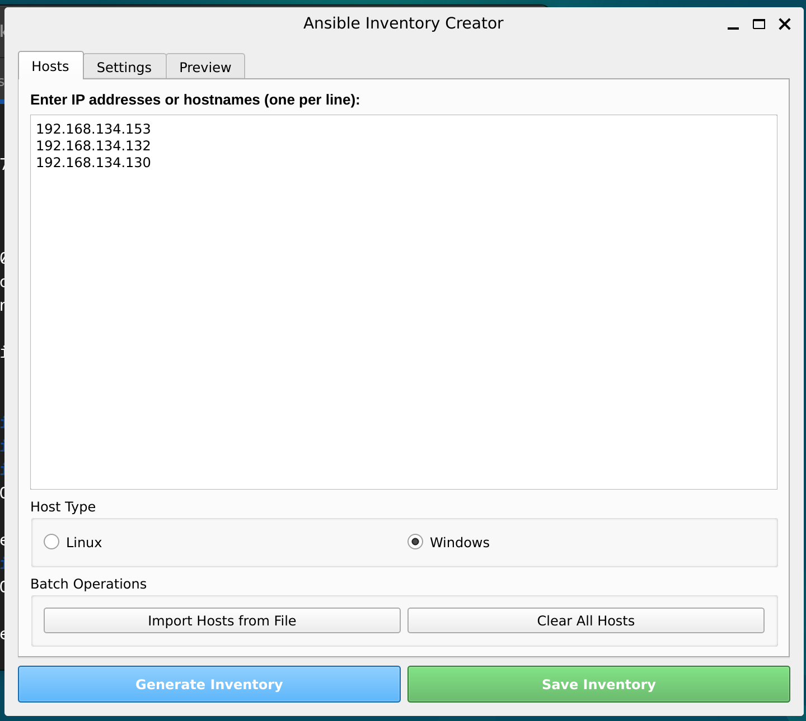

## Create a vault with common credentitals for all servers  
`echo "your_vault_password" > ansible/.vault_pass`  
`ansible-vault create ansible/inventory/group_vars/windows/vault.yaml`
  
### Fill the vault with following:  
`ansible_user: your_windows_username`  
`ansible_password: your_windows_password`  

### Every server build should have `pre-config-scripts` run on them as a pre-requisite

### Inventory Gen-UI
